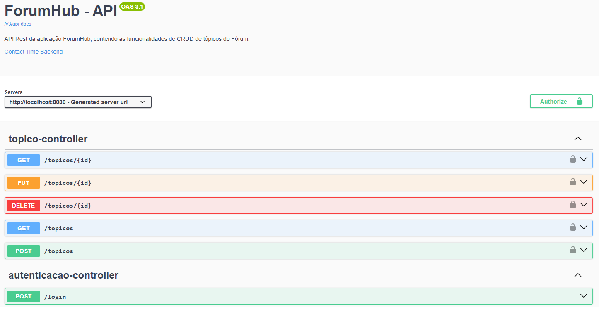

# ForumHub - API


API REST para gerenciamento de tópicos de fórum, permitindo operações de CRUD (criar, listar, atualizar e remover tópicos).

---

## 🚀 Tecnologias Utilizadas

- **Java**
- **Spring Boot**
- **Spring Data JPA**
- **Spring Security** (JWT Stateless)
- **Maven**
- **MySQL**
- **Swagger/OpenAPI**

## ✨ Funcionalidades

- Cadastro, listagem, atualização e remoção de tópicos
- Autenticação JWT
- Documentação interativa via Swagger

## 🛠️ Como rodar o projeto

### Pré-requisitos

- **Java 17** ou superior
- **Maven 3.8 +**
- **MySQL 8.0 +**
- **Git**

Certifique-se de que todas as ferramentas estejam instaladas e configuradas no seu sistema antes de prosseguir.

1. Clone o repositório e abra a pasta no terminal:

   ``` 
   git clone https://github.com/Samuel-Salvador/ForumHub-API
   cd ForumHub-API 
   ```
   
2. Configure o banco de dados:

   1. Certifique-se de ter o MySQL instalado e rodando.
   2. Crie um banco de dados para o projeto (exemplo: forumhub_db), no terminal:
       ```
       mysql -u SEU_USUARIO_MYSQL -p
       ```
       Logo após ele pedirá sua senha, complete com SUA_SENHA_MYSQL, e então:
       ```
       CREATE TABLE forumhub_db;
       ```
       Para sair é só digitar: "exit".
   

   3. Altere as configurações de acesso ao banco no arquivo src/main/resources/application.properties:

        ``` 
        spring.datasource.url = jdbc:mysql://localhost:3306/forumhub_db 
        spring.datasource.username = SEU_USUARIO_MYSQL
        spring.datasource.password = SUA_SENHA_MYSQL
        server.port = 8080 
        ```

3. Compile o projeto, no terminal, execute:
    
   ```
    mvn clean install
    ```
   
4. Execute a aplicação:

    ```
    mvn spring-boot:run
    ```
   
## 📄 Documentação

Veja como é a documentação interativa da API:



Para acesso a documentação é necessário rodar a aplicação e acessar o link no navegador:
http://localhost:8080/swagger-ui/index.html
